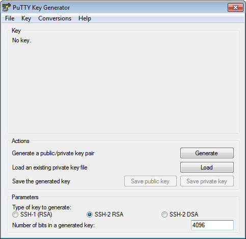
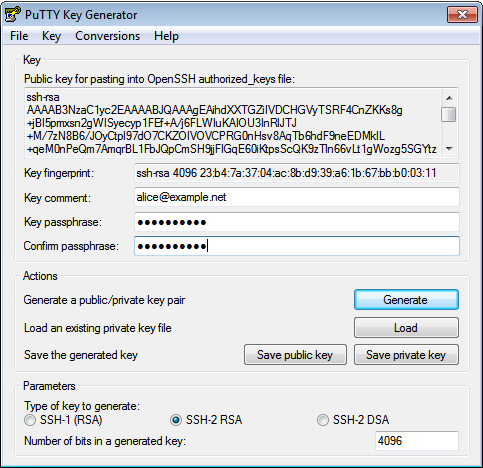
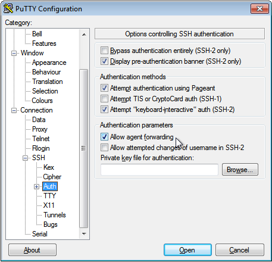
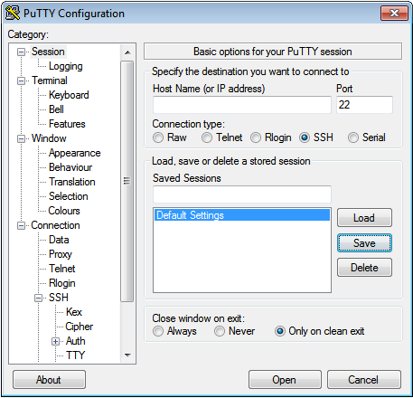

# SSH Keys


## Windows

Download and install the Putty Installer from the official [download page](http://www.chiark.greenend.org.uk/~sgtatham/putty/download.html) (chiark.greenend.org.uk).


### Create an SSH key pair

Start puttygen, increase the `Number of bits in a generated key` field to 4096 and press the Generate button:



Follow the instructions and generate randomness by moving the mouse on the requested area.

When the key is generated, change the `Key comment` to your e-mail address and enter a secure `Key passphrase`. Press the `Save public key` and `Save private key` button and copy the text in the upmost field:



Note: Please use your real email address

### Submit public key

Paste the content of the field `Public key for pasting into OpenSSH authorized_keys file` in an e-mail to [support@snowflake.ch](mailto:support@snowflake.ch) and add a note on which server it should get added, for example: 

```
Add this key to example01.snowflakehosting.ch

ssh-rsa
AAAAB3NzaC1yc2EAAAABJQAAAgEAihdXXTGZiIVDCHGVyTSRF4CnZKKs8g+jBI5pmxsn2gWISyecyp1FEf+A/j6FLWIuKAIOU3InRlJTJ+M/7zN8B6/JOyCtpl97dO7CKZOIVOVCPRG0nHsv8AqTb6hdF9neEDMklL+qeM0nPeQm7AmqrBL1FbJQpCmSH9jjFIGqE60iKtpsScQK9zTln66vLt1gWozg5SGYtzNYDYW0clHcy54XnHdcbKwlD0aAyi+ThfF+JKjbYE0JT+iABDB7K+lxAkOwAzWbjFaan6yBj6K9sL/zOaaeHdPgSEMkk3MXZNUfjhHKeFy3p/u3UoK1FigvxSUkgh9cuXHajOfgsRhp1wXGVw4yJ3W0gp3sziZ67WYuTtCxkiQCKA0frjrP4mb2M+3xKUFBbttbz+NQcvr+VQ71zjYQqL/mbN/wP19fpAisIPsKq1XHGpt0RVcsCu2ILt8U+GZoVb5ZoLFECcmH43H3FT4TyADZCCLSKtZfJyrqyulxdy79N9Qohp//PcbVq71654g/Yj2lwDj0VKF/Eh8lLt+nUlH5y9dJIiFXjiCylC74/QAQEEfX+k2Yt/bjEKklagZ0OdhjMUe2yVb80VI9eZrpjnk03922a1EYyeCZpTkKSqq05ZFGXS+7X57PDImGz66xsR7JuVOJ+J0Wr+zmeaOEFzG5yHskgNncnSk=
alice@example.net
```

WARNING: Never send your private key to anyone, we will request a completely new key if you send us your private key.


### SSH Agent (Pageant)

Putty comes with a SSH agent named pageant. It comes bundled with the putty installer or you can find it on the putty download page. After you started Pageant, it will hide itselve in the systray. To add your key, open the Pageant dialog by right clicking on the systray icon. Please refere to the [Pageant documentation](http://the.earth.li/~sgtatham/putty/0.58/htmldoc/Chapter9.html#pageant) for more information. 


### Agent Forwarding

WARNING: "Agent forwarding should be enabled with caution.  Users with the ability to bypass file permissions on the remote host (for the agent's UNIX-domain socket) can access the local agent through the forwarded connection.  An attacker cannot obtain key material from the agent, however they can perform operations on the keys that enable them to authenticate using the identities loaded into the agent." (openssh manual)

For several actions like checking out a git repository or copying a site form stage to prod you need to forward your SSH Agent. First you have to browse to `Connection->SSH->Auth` on the left-hand side, then you have to enable the `Allow agent forwarding` checkbox:



Afterwards you go back to Session and `Save` the `Default Settings`:




## Mac, Linux


### Create an SSH key pair

If you have access to a SHELL and openssh (Mac/Linux) use the following command to create a new SSH key pair:
```
$ ssh-keygen -t rsa -b 4096 -m PKCS8 -C '<e-mail@address>' -f <keyfile>
```
Note: Please use your real email address

Note: The `-m key_format` flag allows you to specify a different digest algorithm for your private key. Since MD5 is the default digest algorithm a `-m PKCS8` incrieses your security drastically.

```
$ ssh-keygen -t rsa -b 4096 -m PKCS8 -C 'alice@example.net' -f id_rsa_snowflake
Generating public/private rsa key pair.
Enter passphrase (empty for no passphrase): 
Enter same passphrase again: 
Your identification has been saved in id_rsa_snowflake
Your public key has been saved in id_rsa_snowflake.pub.
The key fingerprint is:
09:16:ae:76:9e:8b:25:64:64:63:c7:7a:d1:6f:28:fd alice@example.net
The key's randomart image is:
+--[ RSA 4096]----+
|      .          |
|     o o         |
|    = B .        |
|   + * + +       |
|    * + S o      |
|   + + o o       |
|    . +   E      |
|     + .         |
|    . .          |
+-----------------+
```


### Submit public key

Copy the content of the public key into an email and send it to [support@snowflake.ch](mailto:support@snowflake.ch) with a note on which server it should get added, for example:

```
Add this key to example01.snowflakehosting.ch

ssh-rsa AAAAB3NzaC1yc2EAAAADAQABAAACAQDdvVZsd/DhuL0uOpvU7uSTgm1C+jwXmO/kiN4BTxAexB0GAcfOW5hu99P5I2IlT1rjmlEeXSYlic9kMHEz6NJjj8/Hh9lftpz3IpjCS80I2y8KJ8K5FctZUh8ovzNOxya5SGyBiUWf7zZr4+exFnyqdfgqENA87pHJnZS63cZOq71vIHtacDX3azZbbg6cnkMlWJetOXGAfxQa1ZbAdrGBRadKccvbekO1LckALMd048HGS7I4jjN7lMd/uhq9cnjzpWNrYNODa1mlRX9tVyAt2pTc1s6TD496uuf3J0EwH5HXSfXd78cu/NtGINrqFnlMVrXYoGFO/4h3wEnv1ZhnRlpGXTWCCjQHTdxv/rEef37S0EbQf6asXyeMDxP/oR4gmN7QXs4l1gRVob6PaIzx9bYXIxwmQUVkSXcSANQaxjHUjTon6gufJYIagVodDN7ckwaKH3E5cRJ1Glwo60WgMcLA1lejNVn/ppjX4Xbp6S9kD293+7r684+QXCQ8JWK5qG+LaEmPS2yi6WHXji0+cJEeCGZrm7fhpbTkIFC9qDnZCaleeuXT9i+ALvbouhbV1oa6DK0FtEdf4xvdWeKE8rIlIrTcgGeQXWzA6iu7WlO69vZOWPcjeTlFH4TS1IV/U1FvGuXHMXwrmiEagcIWhXQr3VCWInARuJ2pxgXt4w== alice@example.net
```

WARNING: Never send your private key to anyone, we will request a completely new key if you send us your private key.


### Agent Forwarding

For several actions like checking out a git repository or copying a site form stage to prod you need to forward your SSH Agent. Use the command `ssh -F` or the SSH config directive `ForwardAgent yes` to forward your SSH Agent.


### SSH agent

Since you encrypted your key with a secure passphrase, you have to enter this passphrase every time you attempt to connect to an SSH Server in order to decrypt your private key.

An SSH agent caches your decrypted keys and provides them to SSH client programs. Thus the passphrase must only provided once, when adding your private key to the agent's cache. 

Hint: Usually you would start your agent upon login, and let it run until you logout. There are many diffrent agents, and they are typically well integrated to your OS, SHELL or Desktop Environment. Please refer to the documentation of your favorite agent.

This command starts ssh-agent, the SSH agent of openssh, and exports the SSH_AUTH_SOCK and SSH_AGENT_PID variables:
```
$ eval $(ssh-agent)
```

Then you need to add your private key to the ssh-agent cache:
```
$ssh-add -c <keyfile>
```

You can now connect to any SSH server without typing your passphrase. You can check for a running SSH agent with the command `echo $SSH_AUTH_SOCK`.

Warning: Please use the -c flag to prevent key hijacking. This flag ''indicates that added identities should be subject to confirmation before being used for authentication''. That means, you have to confirm all uses of your key, espessially when you are logged in to a server (with enabled AgentForwarding) and another user tries to steal your identity. Please refere to the documentation of your favorite agent on how to prevent key hijacking.

 Confirmation is performed by the SSH_ASKPASS program mentioned below. Successful confirmation is signaled by a zero exit status from the SSH_ASKPASS program, rather than text entered into the requester.


### Update passphrase without generating a new key

```
$ ssh-keygen -f <keyfile> -p
```

